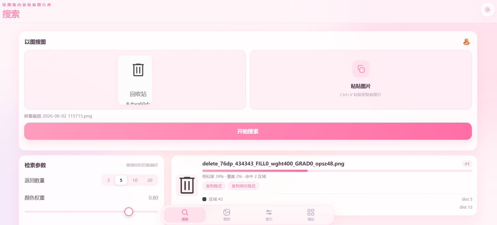
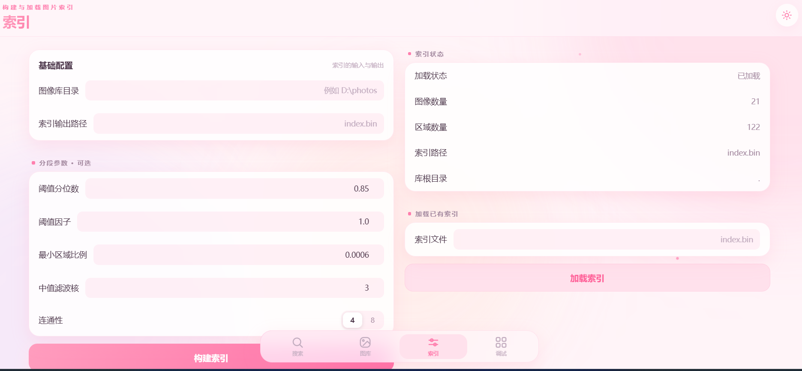

# go-image-search

> Reverse image search using perceptual hash (pHash) and region segmentation — Go tool with CLI + web UI to find similar, cropped, thumbnail or duplicate images across a large local library. No external services.
>
> 基于感知哈希(pHash)与区域划分的图片反向搜索，纯 Go 实现。将图像分割为多个区域并分别哈希，结合骨架衍生图与相似区域合并，支持局部/裁剪/缩略图的相似检索，内置命令行与 iOS 风格 Web 界面，无需外部服务。

Topics: `image-search` `perceptual-hash` `reverse-image-search` `phash` `image-processing` `go` `golang` `computer-vision` `image-retrieval`

支持命令行检索与 iOS 风格 Web 界面。




## 原理

### 方案一：区域感知哈希（pHash）

传统 pHash 对整张图计算指纹，难以处理局部相似或背景差异较大的情况。本项目先将图像划分为多个区域（自适应阈值 + 连通域分析），再对每个区域单独计算感知哈希；感知哈希相近且空间相邻的区域会被合并为组合区域。搜索时基于区域集合进行匹配，从而支持局部/局部衍生图的相似检索。

原始图像与其"骨架图"（衍生图）会分别建索引与检索，任一表示命中即视为相似。

### 方案二：SCZL（形状上下文 + Fourier + HOG + 自适应权重）

基于颜色无关的形状与纹理签名，对"背景色变化/icon 颜色变化/四周文字/填充区域/线条干扰"更鲁棒：

- **占据栅格**（Occupancy 64/32/16）：多分辨率软栅格，直接刻画内部结构
- **Fourier 描述子**：外轮廓全局形状，平移/旋转/缩放/起点不变
- **NCC 归一化互相关**：亮度/对比度仿射不变的全图结构匹配
- **HOG 梯度方向直方图**：颜色无关的边缘结构判别
- **Shape Context**：局部形状点分布匹配（匈牙利算法）
- **多区域匈牙利匹配**：区分多部件图标与单块填充图标
- **自适应权重**：精排阶段基于各维度得分分布动态调整融合权重——某维度"头部与主体分离越明显"说明区分度越强，给更高权重；而非写死固定权重

检索流水线：全局签名粗排 → 6 维精排 + 自适应权重融合 → top-K 输出。

## 解决的实际问题

- **从文字描述中找不到图片**：当用户记不清图片文件名或内容，只能凭"大致长这样"的印象去检索时，用图像本身去搜，胜过手动翻目录。
- **模糊 / 局部 / 缩略图检索**：传统整图哈希遇到裁剪、去色、水印、加边框或只取图片局部时基本失效；本项目通过区域划分 + 骨架衍生图，可使这类衍生图仍能命中原图。
- **大图库的快速反向查重**：为海量图像批量建索引后，能在一次查询中快速找出哪些图片与目标相似，常用于找重复/近似图片、盗图排查、素材去重。
- **无数据库的轻量部署**：索引以二进制文件存储，命令行与本地 Web 界面即可完成建库与检索，无需依赖任何外部服务。

## 实现难点

- **整图哈希的局部性缺陷**：一张图中噪声、背景或装饰区域会污染全局指纹。解法是把"一句话的整图哈希"拆成"多字段的各区域哈希"，让检索以区域为单位进行，从而容忍部分区域不一致。
- **区域划分边界**：阈值选多高、噪声多小算噪声，直接影响区域质量。引入自适应差分阈值 + `-min-area-ratio` 面积过滤 + 中值滤波预处理，把参数暴露为可调项，兼顾不同图像类型。
- **相似区域合并**：相邻且感知哈希相近的区域若各自独立匹配，会导致同一物体被拆成多段而降低命中；通过 `-merge-dist`（pHash 汉明距离）与 `-merge-color`（平均色距离）结合空间邻接判断，合并成组合区域，提高整块物体的匹配度。
- **衍生图一致性**：原图与其"骨架图"（二值轮廓图）外观差异巨大，直接比较哈希几乎不相似。需要在两种表示上分别建索引、分别检索，任一命中即视为相似，并配以颜色权重等手段增强鲁棒性。
- **匹配评分**：不同图像区域数、面积差异很大，需要设计能综合区域命中数量、覆盖率（`cover`）、颜色接近度的评分模型，避免大图/小图得分失真。
- **自适应权重**：各维度区分度因 query 而异——同一 query 下某维度能清晰区分正负样本，另一维度得分却挤在一起。写死权重无法适应这种差异；自适应权重通过 z-score 区分度 + softmax + 先验混合，让每个 query 自动侧重最有判别力的维度。

## 构建

```bash
go build -o bin/go-image-search .
```

## 使用

### 区域感知哈希（pHash 方案）

```
go-image-search build -dir <图像库目录> -out <索引文件> [分段参数...]
go-image-search query -index <索引文件> -q <查询图像> [-top N] [-maxdist D]
go-image-search segments -img <图像> [-out <可视化png>]   # 调试：查看区域划分
go-image-search serve [-addr <host:port>] [-root <图像库目录>] [-index <索引文件>]
```

#### 分段参数

- `-threshold-pct <0~1>` 相邻色差分位数
- `-factor <x>` 阈值因子
- `-min-area-ratio <r>` 噪声区域面积比例阈值
- `-median <k>` 预处理中值滤波核（0 关闭）
- `-connectivity <4|8>` 连通性

#### 合并参数

- `-merge-dist <汉明距离阈值>` 合并的 pHash 汉明距离阈值
- `-merge-color <颜色阈值>` 合并的平均色归一化距离阈值
- `-no-merge` 关闭相似区域合并

### SCZL 方案

```
go-image-search sczl-build -dir <图像库目录> -out <索引文件> [-jobs N]
go-image-search sczl-query -index <索引文件> -q <查询图像> [-top N] [-no-adaptive]
```

- `-jobs N` 并发构建线程数（0=CPU 核数）
- `-no-adaptive` 禁用自适应权重，回退固定先验权重
- 默认启用自适应权重（基于各维度得分分布动态调整融合权重）

### 示例

```bash
# pHash 方案：构建索引
go-image-search build -dir ./images -out index.bin

# pHash 方案：查询
go-image-search query -index index.bin -q query.png -top 5

# SCZL 方案：构建索引
go-image-search sczl-build -dir ./images -out sczl.bin

# SCZL 方案：查询（默认自适应权重）
go-image-search sczl-query -index sczl.bin -q query.png -top 5

# SCZL 方案：查询（禁用自适应，回退固定权重）
go-image-search sczl-query -index sczl.bin -q query.png -top 5 -no-adaptive

# 查看某张图的区域划分
go-image-search segments -img query.png -out seg.png

# 启动 Web 界面
go-image-search serve -root ./images -index index.bin
```

## 目录结构

```
main.go            命令入口（build / query / segments / serve）
sczl_cli.go        SCZL 子命令入口（sczl-build / sczl-query）
console_*.go       控制台编码处理（Windows 设置 UTF-8 代码页）
internal/
  imageproc/       图像加载、滤波与衍生图生成
  phash/           感知哈希
  segment/         区域划分与相似区域合并
  index/           索引序列化与检索（pHash 方案）
  sczl/            SCZL 算法：形状上下文 + Fourier + HOG + 自适应权重
  web/             Web 界面（server.go + assets）
```

## 测试

```bash
go test ./...
```
